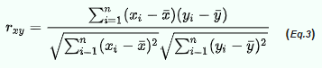

# Movie Recommendation System Using Item Based Collaborative Filtering

## Overview of Item Based Collaborative Filtering
Item based collaborative filtering is a collaborative filtering (CF) algorithm which looks into the set of items the target user has rated and computes how similar they are to the target item and then selects k most similar items for recommendation.

Prediction is computed by taking a weighted averae on the target user's ratings on the most similar items. Similarity between items i and j is computed by isolating the users who have rated them and then applying a similarity computation technique. Below equation shows correlation-based similarity using the pearson-r correlation.

Where, 
n is the sample size
xi, yi are the individual sample points indexed with i
_                                                _
x represents the sample mean and analogously for y

## Dataset
The dataset used here is from https://movielens.org. This dataset has over 100k user ratings for over 1600 movies. This dataset contains two files u.data which contains user_id, movie_id and ratings, u.item file contains movie titles for corresponding movie id's. Pandas package can be used to read and data from both files and merge if necessary.

Recommendation program were implemented using Python, by using core libraries like pandas, scikit–learn, NumPy.

